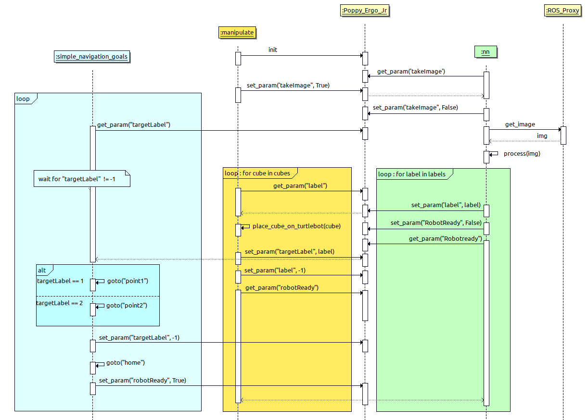

# V. Intégration Poppy Ergo Jr + Turtlebot + Keras

L'intégration consiste à intégrer dans une même cellule robotique les 3 briques logicielles travaillées les autres jours, à savoir :
* La manipulation par le bras robotique
* La navigation avec le robot roulant
* La vision avec le réseau de neurones

Le scenario de l'intégration est un système de tri robotisé de pièces dans un bac 1 ou un bac 2 selon leur marquage au feutre.

## Prérequis

* Avoir suivi les TP *Introduction*, *Manipulation*, *Navigation*, et *Perception* 
* Avoir réalisé une ébauche de nœud Python pour chacun des TP *Manipulation*, *Navigation*, et *Perception*

## Diapositives

{% pdf src="https://files.ros4.pro/integration.pdf", width="100%", height="565px" %}

## 1. Actions séquentielles de la cellule robotique

Les actions de la cellule robotique sont les suivantes :

1. Le réseau de neurone a été entraîné au préalable sur les batchs MNIST avec `learn.py`
2. Le bras robotique prend une photo au dessus du feeder avec sa camera (étape "scan")
3. Cette photo est envoyée au serveur de vision `vision_server.py` qui va :
  3.1. extraire les contours carrés des cubes
  3.2. transmettre les imagettes rognées selon leurs contours au réseau de neurones
  3.3. le réseau de neurone va effectuer une prédiction sur le label marqué à la main 1 ou 2
4. Le noeud de manipulation récupère les coordonnées des cubes et leur label
5. Pour chaque cube, il effectue un pick-and-place pour le positionner sur la remorque du Turtlebot. Le label est passé sur un paramètre `/ros4pro/label`
6. Le Turtlebot lit ce paramètre et se rend au conteneur 1 ou 2
7. Il effectue une rotation de 360° pour faire chuter le cube dans la zone de tri à l'aide du mât



## 2. Comment faire ?
Selon votre avancement, vous n'êtes pas obligés de suivre l'ordre de travail ci-dessous. Il y a peut-être un sujet plutôt qu'un autre où vous êtes le plus en retard que vous devez rattraper.

### 2.1 Le ROS master
Vous aurez désormais 3 machines interconnectées : le robot roulant, le bras et votre station de travail. Donc pensez à en définir une comme ROS master et à mettre à jour tous les ROS_MASTER_URI. Nous vous conseillons d'utiliser le bras comme ROS master car il est branché sur secteur et n'est donc pas interrompu.

**Attention aux conflits** durant les tests puisque tout le monde aura le même ROS master ! Avez-vous bien personnalisé vos noms de robots lors de l'introduction ? 

### 2.2 Le serveur de paramètres
Chaque ROS master démarre un serveur de paramètre qui lui est propre pour y enregistrer des données sous forme de paires de clés/valeurs, par exemple :
```
/robot1/simulated: True
/robot2/simulated: False
/robot1/speed: 1.0
/robot2/speed: 1.2
```
Similairement aux commandes `rostopic` et `rosservice` dans le terminal, la commande `rosparam` dispose d'options pour interagir avec les paramètres enregistrés sur le serveur, et les noms des paramètres sont hierarchisés ave des `/` :
* `rosparam list` : Lister les paramètres du serveur
* `rosparam get /frigo/fruit`: Consulter la valeur du paramètre `/frigo/fruit`
* `rosparam set /frigo/fruit Banane`: Définir (ou écraser) le paramètre `/frigo/fruit` à la nouvelle valeur `Banane`

Côté Python, les noeuds peuvent également définir ou consulter des paramètres avec les fonctions :
* `rospy.get_param("/frigo/fruit")` : pour consulter
* `rospy.set_param("/frigo/fruit", "Banane")` : pour définir ou écraser

#### 2.3. Préparer la navigation
Créez un nouveau noeud `navigate_integrate.py` similaire au noeud `navigate_waypoints.py` utilisé le jour 2. Additionnellement, il devra attendre que le bras robotique ait défini le paramètre `/ros4pro/label` à la valeur 1 ou 2 avant de démarrer la navigation vers le bac 1 ou le bac 2.

Suivant la valeur du paramètre, le robot va déposer le cube à un des deux points. Trouvez les coordonnées de ces points sur la carte et écrivez les dans le script `navigate_integrate.py`. Après avoir déposé le cube, le robot va recommencer et attendre de recevoir une nouvelle valeur.

* Enregistrez une nouvelle carte en partance de l'endroit où le bras va déposer le cube (votre **place** pose)
* Prenez les coordonnées des points 1 et 2 dans le nouveau repère défini par la nouvelle carte, afin de les inscrire dans `navigate_integrate.py` 
* Prévoyez le code pour effectuer des tours sur lui-même au moment de faire chuter le cube dans le  bac

Ce noeud a besoin de la navigation : `roslaunch turtlebot3_navigation turtlebot3_navigation.launch`
Attendez que la navigation soit initialisée pour lancer le noeud : `rosrun ros4pro navigate_integrate.py`


#### 2.4. Préparer la vision
Si vous n'avez pas pris de retard la journée Perception, vous disposez d'un réseau de neurones fonctionnel.

Nous allons le transformer en **service ROS** : on pourra lui faire une requête *Quels sont les cubes que tu vois ?* et il répondra en indiquant les cubes trouvés et leur label, le cas échéant. Comme chaque service ROS est typé, nous allons utiliser le type existant `VisionPredict`, qui comprend, dans la requête :

* `image` : un objet de type `sensor_msgs/Image` correspondant à l'image dans laquelle chercher des cubes 

Dans la réponse de ce service, il n'y a que des listes, car elle comprend entre 0 et n cubes trouvés, qui ont chacun 1 label associé. La réponse comprend donc :

* `label` de type `std_msgs/UInt8[]` : la liste des labels de chaque cube trouvé
* `x_center` de type `std_msgs/UInt32[]` : la liste des coordonées x des barycentres de chaque cube (dans le repère de la caméra)
* `y_center` de type `std_msgs/UInt32[]` : la liste des coordonées y des barycentres de chaque cube (dans le repère de la caméra)
* `x1` de type `std_msgs/UInt32[]` : la liste des coordonées x du coin haut gauche de chaque cube (dans le repère de la caméra)
* `y1` de type `std_msgs/UInt32[]` : la liste des coordonées y du coin haut gauche de chaque cube (dans le repère de la caméra)
* `x2` de type `std_msgs/UInt32[]` : la liste des coordonées x du coin haut droite de chaque cube (dans le repère de la caméra)
* `y2` de type `std_msgs/UInt32[]` : la liste des coordonées y du coin haut droite de chaque cube (dans le repère de la caméra)
* `x3` de type `std_msgs/UInt32[]` : la liste des coordonées x du coin bas droite de chaque cube (dans le repère de la caméra)
* `y3` de type `std_msgs/UInt32[]` : la liste des coordonées y du coin bas droite de chaque cube (dans le repère de la caméra)
* `x4` de type `std_msgs/UInt32[]` : la liste des coordonées x du coin bas gauche de chaque cube (dans le repère de la caméra)
* `y4` de type `std_msgs/UInt32[]` : la liste des coordonées y du coin bas gauche de chaque cube (dans le repère de la caméra)

**Note :** Ainsi, pour chaque cube n°i trouvé dans la photo, `label[i]` est le label détecté par le réseau de neurones, et le point de coordonnées `(x_center[i], y_center[i])` est le barycentre de ce cube dans le repère 2D de la caméra  

Avez l'aide du [tutoriel "Ecrire un service et client Python"](http://wiki.ros.org/ROS/Tutorials/WritingServiceClient%28python%29), créer un fichier `vision_server.py` qui fournit service `/ros4pro/vision/predict` et répond, pour chaque requête contenant une image, la liste des cubes et des labels qu'il a trouvée.

Réalisez d'abord script de test `rosrun ros4pro call_vision_service_example.py` qui sera le client qui va appeler ce service à partir d'une image de votre jeu de test. Cela permet de vérifier que votre modèle et votre entrainement prédit de façon suffisamment fiables les images du jeu de test. Sinon, vérifiez que vous avez bien respecté les consignes de la journée Perception et que votre réseau est entraîné sur un nombre suffisamment élevé d'époques.

Rénetraînez-le autant de fois que nécessaire pour disposer d'un service fiable.
 
#### 2.5. Préparer la manipulation
Pour la manipulation, nous utiliserons le même noeud `manipulate.py` que celui de la journée Manipulation. Lorsqu'on le démarre avec `roslaunch` on ajoutera l'argument `vision` pour lui indiquer qu'il doit faire appel au serveur de vision et donc au réseau de neurones plutôt que d'utiliser l'emplacement vert prédéfini. C'est à dire :
```
roslaunch ros4pro manipulate.launch simulate:=false vision:=true
```

#### 2.6. Votre scenario fonctionne-t-il ?
Pour être considéré comme un succès, votre cellule doit permettre de trier au moins 3 cubes de manière complètement autonome une fois que vous avez démarré les `roslaunch` et `rosrun` nécessaires.

L'objectif est que ce scenario de tri puisse fonctionner dans une cellule en production. Cependant vous constaterez de nombreux défauts.

Relevez et adressez un à un ces défauts pour améliorer le taux de succès de votre cellule de tri.
