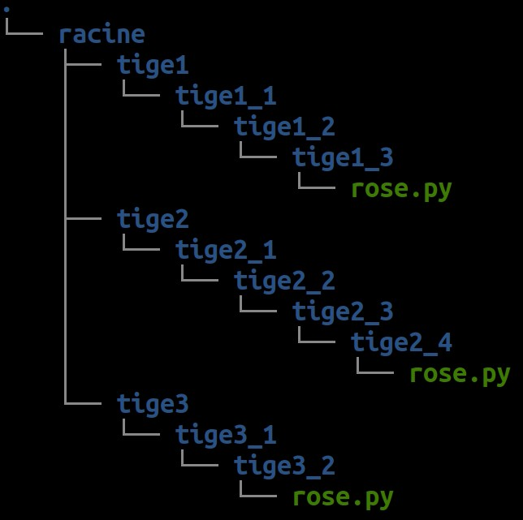

# ROS4PRO : Journée d'Introduction
## 1. Démarrer Ubuntu et ROS

Selon votre situation, une clé USB bootable peut vous être fournie. Dans ce cas, vous devez faire "booter" votre poste de travail sur la clé USB Live fournie.

Dans le cas contraire, il est nécessaire d'avoir vous même installé Ubuntu 18.04 et ROS Melodic. Dans ce cas il se peut que vous ayez à installer vous-même des éléments supplémentaires tout le long des travaux pratiques.

## 2. Prise en main du terminal : le rosier 🌹
⌨️ Pour prendre en main le terminal Linux et les commandes de base, à partir d'un terminal, créez les fichiers et dossiers nécessaires pour réaliser cette hierarchie de fichiers ressemblant à un rosier :



Vous aurez besoin des commandes suivantes :h
* `ls`, pour lister les fichiers et dossiers courants
* `cd`, pour changer le dossier courant
* `mkdir`, pour créer un nouveau dossier
* `touch`, pour créer un nouveau fichier vide
* `nano`, pour créer un nouveau fichier et écrire à l'intérieur
* `tree`, pour afficher la hierarchie de fichiers

## 3. Tutoriels

🧑‍🏫 Vous êtes désormais prêt à utiliser ROS ! Suivez les tutoriels ROS suivants pour découvrir et tester les concepts de base, sachant que votre distribution ROS s'appelle `melodic` :

* [Understanding ROS Nodes](http://wiki.ros.org/ROS/Tutorials/UnderstandingNodes) : Maîtriser ROS master (`roscore`) et lancer des nœuds (`rosrun`)
* [Understanding ROS Topics](http://wiki.ros.org/ROS/Tutorials/UnderstandingTopics) : Envoyer et recevoir des messages dans un topic (`rostopic`)
* [Understanding ROS Services and Parameters](http://wiki.ros.org/ROS/Tutorials/UnderstandingServicesParams) : Déclarer et appeler un service requête/réponse (`rosservice`, `rossrv`)


❓ **Quizz** : quizz au tableau pour mémoriser les commandes importantes

## 4. ⚙️ Préparer vos robots

Pour l'un ou l'autre de vos 2 robots, réalisez les étapes de préparation suivantes expliquées [dans la FAQ robots](../faq/pi/) :
1. Flasher sa carte SD
2. Connecter le robot en wifi
3. Se connecter via SSH au robot
4. Personnaliser le nom de votre robot (si nécessaire)

## 5. FAQ
### 📥 Mise à jour pendant le TP
Il se peut que l'enseignant mette à jour les ressources pendant le cours. Dans ce cas exécutez les commandes suivantes pour récupérer les dernières mises-à-jour :
```bash
roscd ros4pro
git pull origin poppy_tb3_keras
```
Si l'erreur suivante survient :
```
error: Vos modifications locales aux fichiers suivants seraient écrasées par la fusion :
	<LISTE DE FICHIERS>
Veuillez valider ou remiser vos modifications avant la fusion.
Abandon
```
Alors les fichiers spécifiés ne peuvent pas être mis à jour car cela détruirait les modifications que vous avez apportées à la liste des fichiers indiquée. Il est recommandé de demander conseil avant d'essayer une autre action pour récupérer la mise à jour.
