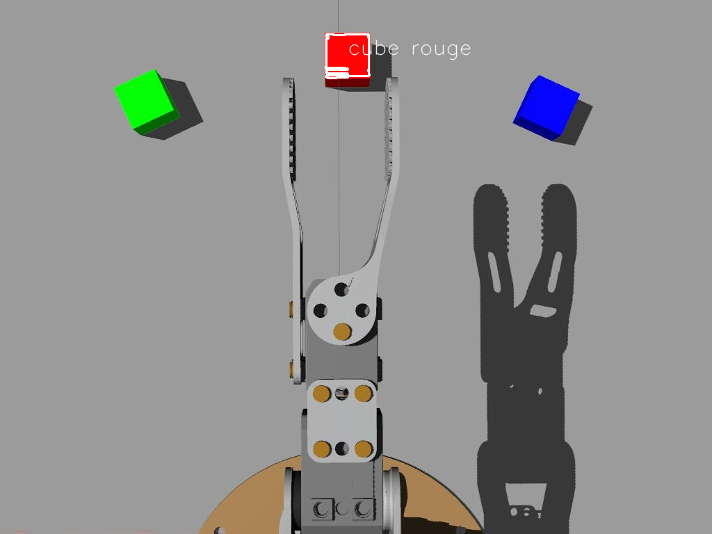

- [IV. Perception avec OpenCV](#orgdf41233)
  - [Introduction à OpenCV](#org134b5d0)
  - [Ouverture d'une image](#orge106897)
  - [Seuil sur la couleur](#orgf888e92)
  - [Détection des cubes](#org281dbcf)
  - [Intégration avec ROS](#orga2455b8)


<a id="orgdf41233"></a>

# IV. Perception avec OpenCV

Le domaine de "Computer Vision" (CV, ou vision par ordinateur) est une branche de l'intelligence artificielle, qui traite des techniques permettant d'extraire des informations de "haut niveau" utiles à partir d'images. Donc ce domaine développé depuis les années 60, on retrouve généralement des techniques provenant des mathématiques, du traitement d'images, des neurosciences, de l'apprentissage artificiel&#x2026; Nous allons ici effleurer ce domaine en nous familiarisant avec [OpenCV](https://opencv-python-tutroals.readthedocs.io/en/latest/py_tutorials/py_tutorials.html).


<a id="org134b5d0"></a>

## Introduction à OpenCV

OpenCV est une bibliothèque logicielle qui est devenue le "standard" du domaine. Cette bibliothèque fournit un énorme ensemble de fonctionnalités et d'algorithmes à la pointe de l'état de l'art. Entre autres sont disponibles:

-   Des mécanismes d'entrées/sorties des images et flux vidéos (caméras, fichiers&#x2026;)
-   Des mécanismes de traitement d'images (gestion des formats, couleurs, déformations&#x2026; )
-   Des milliers d'algorithmes développés par la communauté et les industriels (reconnaissance d'image, suivi d'objet, vision 3D, apprentissage&#x2026;)


<a id="orge106897"></a>

## Ouverture d'une image

-   Téléchargez l'image: 
-   Créez un fichier `couleurs.py`

    ```python
    import numpy as np
    import cv2 as cv
    img = cv.imread('ergo_cubes.jpg')
    ```

-   Quelle information nous donne `print(img.shape)` ?

    

-   On peut accéder à chaque pixel par indexation du tableau `img` avec `img[LIGNE, COLONNE]` (ce qui est très inefficace), que représente la valeurs données par `img[170,255]` ?
-   Pour accéder au différents canaux de couleur on peut de même utiliser: `img[:,:,CANAL]` avec `CANAL` la couleur voulue.
-   On peut facilement créer des régions d'intérêt (ROI) en utilisant les mécanismes disponibles dans python:

    ```python
    roi=img[140:225, 210:310]
    ```

-   OpenCV offre également quelques fonctionnalités pratiques d'interface utilisateur (GUI). Pour afficher une image:

    ```python
    cv.imshow("Mon image", roi) #on donne un nom unique à chaque fenêtre
    cv.waitKey(0) #permet d'attendre à a l'infini
    ```

-   Enfin, on peut écrire les images dans des fichiers:

    ```python
    cv.imwrite("roi.png", roi)
    ```

-   Affichez les trois canaux de couleur dans des fenêtres différentes


<a id="orgf888e92"></a>

## Seuil sur la couleur

Nous avons vu que les images sont généralement représentés dans l'espace `BGR`, ce qui est cohérent avec le fonctionnement du pixel de l'écran (et du capteur), mais moins évidant lorsque l'on souhaite travailler sur les couleurs. Comment par exemple définir le volume 3D dans l'espace BGR représentant le "rose"? C'est pourquoi pour traiter la couleur, il est recommandé de convertir l'encodage de l'image dans un autre espace. L'espace le plus couramment utilisé est le [HSV](https://fr.wikipedia.org/wiki/Teinte_Saturation_Valeur) (Hue, Saturation, Value ou Teinte, Saturation, Valeur).

-   Pour convertir une image de BGR vers HSV il suffit d'utiliser:

    ```python
    img_HSV = cv.cvtColor(img, cv.COLOR_BGR2HSV)
    ```

    On notera que l'espace HSV est encodé avec H dans [0, 179], S dans [0,255] et V dans [0,255]

-   On peut ensuite appliquer un seuil avec:

    ```python
    img_seuil = cv.inRange(img_HSV, (MIN_H, MIN_S, MIN_V), (MAX_H, MAX_S, MAX_V))
    ```

    Le résultat de la fonction de seuil `inRange` est une image binaire

-   Expérimentez avec les valeurs de seuil pour ne faire apparaître que le cube rouge Note: il est facile de créer des "trackbars" pour changer en temps réel les valeurs, voir le [tutoriel](https://docs.opencv.org/master/d9/dc8/tutorial_py_trackbar.html)


<a id="org281dbcf"></a>

## Détection des cubes

Nous sommes maintenant capable de sélectionner des pixels en fonction de leur couleur, il nous faut encore "regrouper" ces informations afin de détecter et reconnaître les cubes.

-   Une méthode simple consiste à considérer que les pixels d'une couleur choisie font partie d'un "blob" (une région de pixels voisins) représentant le même objet. Dans l'image binaire résultat du seuil, il nous suffit de chercher le `contour` des zones blanches. Pour cela nous allons utiliser la fonction `findContours()` (voir le [tutoriel](https://docs.opencv.org/3.4/d4/d73/tutorial_py_contours_begin.html))

    ```python
    imgret, contours, hierarchy = cv.findContours(
       img_seuil, cv.RETR_EXTERNAL, cv.CHAIN_APPROX_SIMPLE)
    ```

    `imgret` est la même image que `img_seuil` `contours` est une liste contenant tous les contours trouvés `hierarchy` contient les informations sur la hiérarchie des contours (les contours à l'intérieur des contours)

-   Sur une image "naturelle" (avec du bruit) les contours trouvés seront rarement parfaits. Il est possible de "filtrer" ces contours en ne considérant par exemple que ceux dons la surface est cohérente avec les objets recherchés (voir le [tutoriel](https://docs.opencv.org/3.4/dd/d49/tutorial_py_contour_features.html))
-   Parcourez la liste des contours et dessinez les contours dont la surface est comprise entre 2500 et 3700 On utilisera une boucle sur `contours`, la fonction `contourArea()` retournant la surface d'un contour, ainsi que la fonction de dessin `drawContours()` (dessinez sur l'image d'origine)
-   Une fois le contour du cube trouvé, nous pouvons chercher son centre avec la fonction `moments()` avec une fonction telle que:

    ```python
    def trouver_centroid(cnt):
        M = cv.moments(cnt)
        if M['m00'] > 0.0:
           cx = int(M['m10']/M['m00'])
           cy = int(M['m01']/M['m00'])
           return (x, y)
        else:
           return (0, 0)
    ```

    Nous pouvons ensuite utiliser la position obtenue pour écrire un texte:

    ```python
    cv.putText(img, 'cube', (x, y), cv.FONT_HERSHEY_SIMPLEX, 1,(255, 255, 255), 1, cv.LINE_AA)
    ```



-   Maintenant que nous sommes capable de détecter un cube d'une couleur, étendez le programme pour détecter la présence et la position des 3 cubes


<a id="orga2455b8"></a>

## Intégration avec ROS

Nous allons maintenant intégrer cette détection de cube coloré à ROS en lisant l'image de la caméra de Ergo Jr simulée par Gazebo.

-   On peut visualiser les images avec l'outil `rqt_image_view`: `rosrun rqt_image_view rqt_image_view` Les images brutes sont publiées sur le topic: `/ergo_jr/camera_ergo/image_raw`
-   Attrapez chacun des cubes et récupérez des images de la caméra qui vous servirons à vérifier le bon fonctionnement de votre programme précédant
-   Dans votre package ROS créez le fichier `ros4pro/src/vision.py`

    ```python

    import rospy
    from sensor_msgs.msg import Image
    from std_srvs.srv import Trigger, TriggerResponse
    from cv_bridge import CvBridge
    import cv2 as cv
    import numpy as np


    class NodeVision(object):
        def __init__(self):
    	# Params
    	self.image = None
    	self.debug_img = None
    	self.br = CvBridge() #pour la conversion entre les imags OpenCV et les images ROS
    	# Node cycle rate (in Hz).
    	self.loop_rate = rospy.Rate(10)

    	# Pour publier des images pour le debuggage
    	self.img_pub = rospy.Publisher(
    	    '/ergo_jr/camera_ergo/debug_img', Image, queue_size=1)

    	# Pour récupérer les images du robot simulé
    	rospy.Subscriber(
    	    '/ergo_jr/camera_ergo/image_raw', Image, self.callback)

    	# Créaction d'un service (on utilise le srv standard Trigger)
    	self.service_vision = rospy.Service(
    	    '/ergo_jr/cube_detection', Trigger, self.handle_cube)

        def trouver_cube(self,img):
    	raise NotImplementedError("Complétez la partie 2.4 avant d'exécuter")
    	# ICI le traitement OpenCV

    	# retour du résultat
    	resp = TriggerResponse()
    	# Si pas de cube
    	# resp.success = False
    	# Sinon
    	# resp.success = True
    	# resp.message="COULEUR"
    	return resp

        def handle_cube(self, req):
    	#Méthode callback qui sera éxécutée à chaque appel du service

    	# retour du résultat
    	resp = TriggerResponse()
    	resp.success = False

    	# uniquement si l'image existe
    	if self.image is not None:
    	    imgtmp = self.image.copy()
    	    # on appelle la méthode de traitement d'image
    	    resp = self.trouver_cube(imgtmp)

    	return resp

        def callback(self, msg):
    	#méthode callback qui sera éxécutée à chaque reception d'un message
    	self.image = self.br.imgmsg_to_cv2(msg, "bgr8") #On converti l'image ROS en une image OpenCV

        def start(self):
    	rospy.loginfo("Démarage du node vision")

    	while not rospy.is_shutdown():

    	    if self.image is not None:

    		# éventuellement, publication d'une image de débug, ici une copie de l'image d'origine
    		self.debug_img = self.image.copy()
    		self.img_pub.publish(
    		    self.br.cv2_to_imgmsg(self.debug_img, "bgr8")) #On converti l'image OpenCV en une image ROS

    	    self.loop_rate.sleep()


    if __name__ == '__main__':
        rospy.init_node("Vision")
        vision = NodeVision()
        vision.start()

    ```

-   À partir de ce squelette, intégrez votre programme de détection des cubes colorés On notera qu'il est nécessaire d'utiliser [CvBridge()](https://wiki.ros.org/cv_bridge/Tutorials/ConvertingBetweenROSImagesAndOpenCVImagesPython) afin de faire le lien entre les images OpenCV et les images ROS. On peut appeler le service créé avec la commande: `rosservice call /ergo_jr/cube_detection [TAB]`
-   Dans votre programme de mouvement, utilisez l'appel à ce service afin de détecter la couleur du cube attrapé et faites une pile de cube Rouge/Vert/Bleu Modifiez les couleurs dans le fichier launch `spawn_cubes.launch` pour tester différentes combinaisons