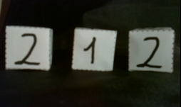
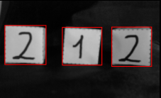
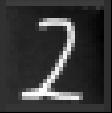

# IV. Perception avec Keras

**tensorflow** et **keras** sont deux modules Python qui permettent de construire des réseaux de neurones apprenants. Nous allons les utiliser ici sur des imagettes sur lesquelles sont inscrits des chiffres écrits manuellement au feutre avec différentes calligraphies. Le réseau de neurones que vous allez créer devra apprendre à déterminer quel chiffre est marqué, ce que l'on appelle **classifier**.

## Prérequis

* BAC+2 et +
* Bonne compréhension de Python et numpy

## Diapositives

{% pdf src="https://files.ros4.pro/perception.pdf", width="100%", height="565px" %}

## 0. Installation

📥 Le code source à télécharger se trouve à [cet emplacement](https://github.com/cjlux/ros4pro_perception).

Une fois téléchargé, vous devez installer les packages Python requis en tapant la commande suivante (depuis le dossier `ros4pro_perception`) :

```bash
pip install -r requirements.txt
```

## 1. Documentation

Pour anlyser et compléter les codes fournis, vous aurez besoin de consulter plusieurs documentations.

De manière générale, vous aurez besoin de numpy. Si vous n'êtes pas familier avec ce module, vous pouvez consulter:

* [Numpy cheatsheet](https://s3.amazonaws.com/assets.datacamp.com/blog_assets/Numpy_Python_Cheat_Sheet.pdf)
* [Numpy Documentation](https://numpy.org/devdocs/user/quickstart.html)

Pour la partie détection des faces des cubes et pré-processing, nous utiliserons `scikit-image`:

* [Scikit-Image Documentation](https://scikit-image.org/docs/stable)

Enfin, pour la partie reconnaissance, nous utilsons le `keras` inclus dans le module `tensorflow` depuis sa version 2. Un point d'entrée sur l'API Séquentielle peut être consulté sur cette page :

* [keras API Sequential](https://www.tensorflow.org/guide/keras/sequential_model?hl=fr)

## 2. Partie apprentissage

### 2.0 Travail préliminaire avec les notebooks Jupyter 📒

En tapant la commande `jupyter notebook` depuis le dossier `ros4pro_perception` vous pouvez charger les deux notebooks *à trous* pour la prise en main du *machine learning* avec **tensorflow-keras** :

* `notebook/TP1_MNIST_dense.ipynb` : utiliser ce notebook pour l'acquisition des bases sur le *machine learning*, la banque d'images MNIST utilisée pour l'entraînement des réseaux, et la construction d'un réseau de neurones dense, son entraînement et son exploition, conduisant à un taux de reconnaissance des images MNIST voisin de 98 %.

* `notebook/TP2_MNIST_convol.ipynb` : utiliser ensuite ce notebook pour la construction d'un réseau convolutif, son entraînement avc les images MNIST et son exploition, conduisant à un taux de reconnaissance voisin de 98 %.

Une fois familiarisé avec les principes de construction des réseaux denses et convolutifs, vous pouvez aborder l'exploitation de vos acquis en utilisant les programmes Python du répertoire `src/`.

### 2.1  Chargement des images MNIST

Ouvrir le fichier `src/learning.py`, prendre connaissance du code, puis lancer le programme.

Avant d'appuyer sur entrée, assurez-vous que vous savez répondre aux questions suivantes :

* Que contiennent les variables `x_train` et `y_train` ?

* Pourquoi la fonction `load_data` renvoie-t-elle également les données `x_test` et `y_test` ?

* Quelles sont les formes respectives de `x_train` et `y_train` ?

### 2.2 Prévisualisation des données brutes

Appuyer sur entrée pour continuer, et observer les images :

* Quelles sont les valeurs des pixels blancs et des pixels noirs ?

* Observer les données et leurs labels. Toutes les images sont elles simples à classifier correctement ? Ferriez vous des erreurs en les classifiants ?

### 2.3 Préparation des données

Fermer la fenêtre et appuyer à nouveau sur entrée :

* Quelles sont les formes de `x_train` et `y_train` maintenant?

* Pourquoi ces changements ?

### 2.4 Prévisualation des données préparées

Appuyer à nouveau sur entrée et observer les images:

* Quelles sont les valeurs des pixels blanc et des pixels noirs maintenant?

* Regarder la fonction `prepare_input` : quelle transformation des images est effectuée?

### 2.5 Le modèle du réseau convolutif

Arrêter le script. Dans le fichier source `learning.py` modifier la fonction `build_model` pour implémenter le réseau convolutif *LeNet* vu dans le notebook `TP2_MNIST_convol.ipynb`.

Une fois fait, relancer le script et faire défiler jusqu'à la partie 2.5 (vous pouvez modifier `SHOW_SAMPLES` pour ne pas afficher toutes les fenêtres...) :

* vérifier les informations des couches sur le résumé du modèle...

### 2.6 La fonction de coût et l'optimiseur

Arrêter le script. Dans le notebook du TP1 nous avons vu que la fonction de coût **entropie croisée** (*cross entropy*) était la plus adaptée au calcul d'erreur avec des sorties au format *hot-one* :

* Vérifier que c'est bien la fonction de coût utilisée dans l'appel à `modele.compile(...)`

L'optimiseur est utilisé pour se déplacer vers un minimum sur la surface dessinée par la fonction de coût dans l'espace des paramètres.

Un des algorithmes les plus simples est la __descente de gradient__ (GD) et consiste à se déplacer dans le sens de la pente la plus forte à chaque pas de temps :

* Sous quelle hypothèse cet algorithme permet-il de trouver le minimum global de la fonction de coût selon vous ?

* Pensez vous que cette hypothèse soit vérifiée pour les réseaux de neurones ?

* Que se passe-t-il si cette hypothèse n'est pas vérifiée ?

__Adam__ est un optimiseur plus complexe que GD. Sur l'image suivante, on voit plusieurs optimiseurs se déplacer sur une fonction de coût :

(source : github.com/Jaewan-Yun/optimizer-visualization/raw/master/figures/movie11.gif)

Concentrez-vous sur Adam et GD:

* Quelle semble être la caractéristique de Adam comparée a GD ?

Une autre caracteristique de l'algorithme GD, est que le pas effectué à chaque itération est fixe. L'image suivante montre Adam et GD dans un cas ou la pente devient trés forte :

(source : github.com/Jaewan-Yun/optimizer-visualization/raw/master/figures/movie9.gif)

* GD arrive-t-il à converger ? Comprenez vous pourquoi ?

* Adam ne semble pas soumis au même problême que GD ? Quelle autre caractéristique de Adam cela montre t-il ?

pour finir :

* Quelle conclusion pouvez vous tirer sur l'utilité de GD pour entraîner des réseaux de neurones ?

* Quel est l'optimiseur utilisé dans le code ?

### 2.7 Entraînement

* Observer la fonction `train_model` pour vérifier la présence et le paramétrage du mécanisme de gestion de l'_over-fit_.

* Relancer le code jusqu'au déclenchement de la partie 2.7 : vous devriez voir les itérations d'entraînement se succéder et s'arrêter sur un événement __early stopping__.

### 2.8 Poids appris

Appuyer sur entrée pour visualiser les noyaux convolutifs appris par le réseau de neurones :

* En observant les noyaux de la première couche, arrivez vous à distinguer le genre de _features_ qui seront extraites par chacun ?

* Pouvez vous en faire de même pour la deuxième couche ?

### 2.9 Activations

Appuyer sur entrée, puis entrer un indice (un entier de valeur inférieure a 12000) :

* Après la première couche de convolution, les _features_ extraites correspondent elles à celles que vous imaginiez ?

* Après la première couche de _pooling_, les _features_ présentes auparavant sont-elles conservées ?

* Après la deuxième couche de _pooling_, diriez vous que de l'information spatiale est toujours présente ? Autrement dit, les activations ressemblent elles toujours à des images ?

### 2.10 Entraînement final

Arrêter le script. Jusqu'à présent, nous avons travaillé sur l'ensemble des images montrant des chiffres de 0 à 9, mais pour la suite nous n'aurons besoin que des images de 1 et de 2 :

* Changer la valeur de la variable `CLASSES` pour ne garder que les classes qui nous intéressent.

* Changer `SHOW_SAMPLES`, `SHOW_WEIGHTS` et `SHOW_ACTIV` si vous désirez moins d'affichage graphique...

* Entraîner le réseau avec le nouveau jeu de données réduites, puis le sauvegarder en donnant le nom d'un répertoire où sauvegarder les fichiers du réseau entraîné.

Vous pouvez passer maintenant à la **Partie Vision** qui permettra, une fois achevée, d'observer les inférences du réseau avec les images des cubes correctement traitées...

## 3. Partie Vision

Le but de la partie Vision est de traiter les images fournies par la caméra du robot :



pour trouver les contours des cubes :



et en extraire des images compatibles MNIST :



qui seront envoyées au réseau de neurone pour classification en '1 ou '2'...

### 3.1 Présentation des données

Ouvrir le fichier `src/detection.py` et lancer le script. Une image exemple issue de la caméra du robot devrait vous être présentée :

* Observer les valeurs de pixels ? Quelles sont les valeurs de pixels blancs et noirs ?

* De manière générale, la face des cubes est elle semblable aux images MNIST ?

### 3.2 Binarisation de l'image

Appuyer sur entrée, et vous devriez voir s'afficher une image binarisée :

* Pouvez vous penser à un algorithme permettant d'arriver à un résultat similaire ?

Dans le code, observer la fonction `binarize` :

* À quoi sert la fonction `threshold_otsu` ? (voir au besoin la documentation  `scikit-image`).

* Ajouter une ligne pour afficher la valeur de `thresh` à chaque appel de la fonction. Cette valeur est elle la même pour toutes les images ?

En commentant successivement les lignes les utilisant, observer l'impact de chacune des fonctions suivantes :

* À quoi sert la fonction `closing` ?
* À quoi sert la fonction `clear_border` ?
* À quoi sert la fonction `convex_hull_object` ?
* Conclure en résumant l'enchaÎnement des opérations effectuées dans la fonction `binarize`.

* pourquoi faut-il éviter d'avoir des cubes qui touchent les bords de l'image ?

### 3.3 Recherche des contours des cubes

Appuyer sur entrée pour faire défiler quelques images dont les contours ont été détectés.

Observer la fonction `get_box_contours`:

* À quoi sert la fonction `label` ?
* À quoi sert le paramètre `area` ?
* À quoi sert la fonction numpy `argsort` utilisée à la fin pour le ré-arragement des contours ? Pourquoi cette opération est elle importante ?
* Conclure en résumant l'enchaînement des opérations effectuées dans la fonction `get_box_contours`.

### 3.4 Extraction des vignettes

Appuyer sur entrée pour faire défiler quelques images dont les vignettes ont été extraites.

Observer la fonction `get_sprites`:

* Qu'est ce qu'une "transformation projective" ?

### 3.5 Préparation des images

Pendant la phase d'apprentissage, nous avons étudié la préparation qui était faite des images.

Les vignettes que nous allons présenter au réseau de neurones doivent aussi être traitées pour avoir les mêmes caractéristiques que les images d'entrainement MNIST :

* Remplir la fonction `preprocess_sprites` pour effectuer ce traitement...

Une fois fait, exécuter le script jusqu'à la fin et conclure sur l'allure des images traitées.

Vous pouvez maintenant ouvrir le fichier `main.py` pour tester l'intégration de la détection et de la reconnaissance par réseau apprenant...

## 4. Intégration

Il est maintenant temps d'intégrer les deux parties du pipeline pour l'utilisation finale. Ouvrez le fichier `main.py` à la racine du projet.

Pour que les deux parties du pipeline s'adaptent correctement, vous avez complété la fonction `preprocess_sprites` qui permet de mettre les vignettes renvoyées par la partie détection dans un format compatible avec celui des images MNIST.

Exécuter maintenant le programme `main.py` : donner le nom d'un dossier qui contient les fichiers des poids du réseau entraîné et vous devriez commencer à obtenir la reconnaissance des chiffres '1' et '2' dans les images fournies.

Il faudra certainement refaire plusieurs fois l'entraînement du réseau en jouant sur plusieurs paramètres avant d'obtenir un réseau entraîné qui fonctionne correctement :

* changer la valeur de la graine `SEED` peut conduire à un état initial des poids du réseau qui donne un entraînement meilleur ou pas...

* augmenter/diminuer `BATCH_SIZE` peut aussi améliorer ou pas les performances du réseau entraîné...

* augmenter/diminuer le paramètre `patience` du callback `EarlyStopping`...

* enfin, tous les paramètres qui définissent les couches de convotution et de __spoling__ du réseau convolurif sont autant de possibilités d'améliorer ou pas les performances du réseau entraîné....

À vous de jouer pour obtenir un réseau entraîné discriminant le mieux possible les chiffres '1' et '2' des images extraites des captures de la caméra duu robot...

Pour confirmer la qualité de votre réseau entraîné vous pouvez enregistrer vos propres fichiers PNG avec les images faites avec la caméra du robot en utilisant le service ROS `/get_image`. Aidez-vous des idications du paragraphe __2.4. Récupérer les images de la caméra en Python__ dans la section [Manipulation/Poppy Ergo Jr](https://learn.ros4.pro/fr/manipulation/ergo-jr/) en complétant avec l'instruction `cv2.imwrite(image, file_name)` pour l'écriture du fichier PNG. Vous pouvez déposer vos fichiers dans le répertoire `data/ergo_cubes/perso` et modifier en conséquence la variable `im_dir` du fichier `main.py`. Lancez le programme et observez la performance de votre algorithme sur les données de votre propre environnement.
