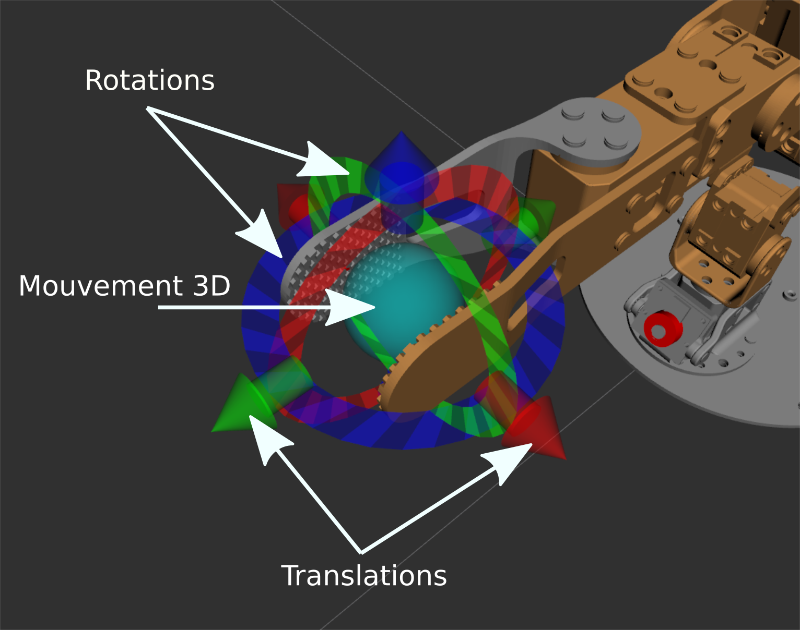
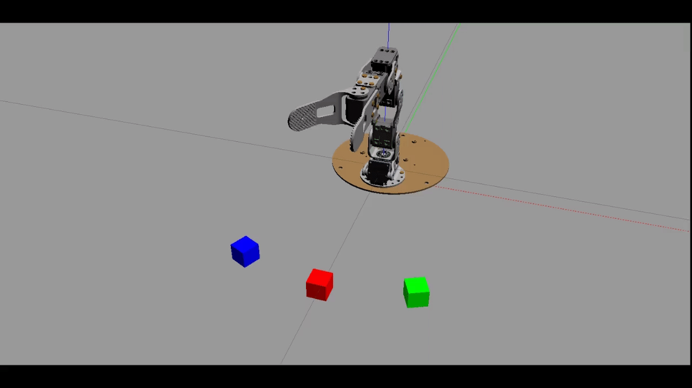

# VII. Simulation avec Gazebo

En robotique il est souvent très utile de pouvoir travailler en simulation. Un simulateur physique permet essentiellement de simuler des forces/couples sur des objets et des articulations. [Gazebo](http://gazebosim.org/) est un environnement de simulation **physique** pour robotique, supporté par ROS. Nous nous servirons de la simulation dans Gazebo de manière transparente, "comme si" il s'agissait du véritable robot.


La simulation va nous permettre :

1.  De charger des modèles URDF
2.  De simuler des moteurs
3.  De simuler une caméra
4.  De simuler les contacts

Notons que Gazebo est constitué d'un serveur (non graphique, `gzserver`) et d'un client (graphique, `gzclient`) ce qui permet également de calculer une simulation sur une machine distante par exemple.


## 1. Lancement de Gazebo avec un monde "vide"

`roslaunch gazebo_ros empty_world.launch` Ce que nous allons utiliser, mais il est bien sur possible de créer des environnements plus complexes.


## 2. Chargement d'un modèle

Les modèles sont décrit par un fichier xml selon la norme [URDF](https://wiki.ros.org/urdf) (Universal Robot Description Format).


### 3. Un simple cube

Pour la suite du TP, clonez le package [poppy_ergo_jr_gazebo](https://github.com/poppy-project/poppy_ergo_jr_gazebo) dans votre ROS workspace.

Dans `poppy_ergo_jr_gazebo/urdf` on peut voir la définition d'un cube. Pour charger cet URDF dans Gazebo : `rosrun gazebo_ros spawn_model -file cube.urdf -urdf -model test -x 0 -y 0 -z 1`

-   Quelles sont les dimensions du cube ?
-   Quelle est la masse du cube ?
-   Expérimentez pour expliquer la différence entre `visual` et `collision` (menu `View/Collisions`)
-   Observez la position du cube avec `rostopic echo -n 1 /gazebo/model_states`
-   Modifiez cette position avec `rosservice call /gazebo/set_model_state [TAB]` (Utilisez la complétion du terminal avec [TAB] pour remplir le message)
-   Appliquez une force de 10N selon l'axe x pendant 5s sur le cube en utilisant : `rosservice call /gazebo/apply_body_wrench` (Quel est le "body<sub>name</sub>" à utiliser ?)

Pour supprimer le modèle : `rosservice call gazebo/delete_model "model_name: 'test'"`


### 4. Chargement du modèle du robot

On utilise ici un format intermédiaire "xacro", permettant d'ajouter un capacité de "script" (pour calculer des position par exemple) et générer un URDF. On peut visualiser la topologie du modèle avec : `urdf_to_graphiz poppy_ergo_jr.urdf` (un pdf est généré)

Ouvrez le PDF obtenu puis déterminez :

-   Que représentent les rectangles ?
-   Que représentent les bulles ?
-   Que représentent les flèches et surtout les valeurs xyz et rpy associées ?

Pour importer le modèle dans Gazebo : `roslaunch poppy_ergo_jr_gazebo load_ergo_model.launch` On peut "explorer" le modèle dans le menu à gauche. Pour mieux visualiser les articulations : `View/Transparent` `View/Joints`

Le modèle s'effondre car les moteurs ne sont pas simulés.

-   Appliquez un couple de -0.5Nm sur l'articulation `m2` pendant 3s avec : `rosservice call /gazebo/apply_joint_effort [TAB]`


## 5. Chargement des contrôleurs de moteurs

Afin de rentre la simulation plus réaliste, nous allons lancer des contrôleurs de moteurs qui vont simuler le comportement de moteurs réels. Il existe plusieurs type de contrôleurs disponible dans Gazebo, nous allons tout d'abord expérimenter avec les contrôleurs en position les plus simples.

-   lancez : `roslaunch poppy_ergo_jr_gazebo load_ergo_position_controllers.launch` On constate la création de `topics` pour chaque contrôleur
-   Envoyez des commandes en position : `rostopic pub /ergo_jr/m2_position_controller/command [TAB] [TAB]`
-   Comment contrôler la position de la pince dans l'espace cartésien?


## 6. MoveIt

Dans le cas général, calculer les mouvements nécessaires pour atteindre un objectif sans collision est un problème compliqué (cf. robotique théorique). Cette tâche est effectuée par un **planificateur**, tel quel [MoveIt](https://moveit.ros.org/) qui intègre :

-   Le modèle cinématique du robot (à partir de l'URDF)
-   Une gestion des collisions (internes et avec l'environnement)
-   Un planificateur de trajectoire

    


### 7. Démarrer MoveIt

Précédemment nous avons expérimenté avec les contrôleurs en position. MoveIt a besoin de contrôleurs légèrement différents (contrôleurs de trajectoire).

-   Lancez tout d'abord Gazebo et charger le modèle du robot. Puis lancez les contrôleurs en trajectoire avec : `roslaunch poppy_ergo_jr_gazebo load_ergo_controllers.launch` ⇒ Vous pouvez aussi combiner ces 3 étapes avec un seul fichier .launch : `roslaunch poppy_ergo_jr_gazebo start_gazebo.launch gripper:=true lamp:=false`
-   Lancez MoveIt avec : `roslaunch poppy_ergo_jr_moveit_config start_moveit.launch gripper:=true lamp:=false`
-   Essayez de manipuler le robot : 
-   Dans `Query/Planning Group` sélectionnez `arm`, dans `Options` cochez `Allow Approx IK Solutions`
-   Cliquez sur `Planning/Plan and Execute` observer Rviz et Gazebo


### 8. Créer un `node` python pour contrôler le robot
#### 8.1. Créer un package ROS **ros4pro**

```
cd ~/catkin_ws/src
catkin_create_pkg ros4pro             # Cette commande créé le package
mkdir -p ros4pro/src                  # On créé un dossier src dans le package
touch ros4pro/src/manipulate.py       # On créé un noeud Python "manipulate.py"
chmod +x ros4pro/src/manipulate.py    # On rend ce noeud exécutable pour pouvoir le lancer avec rosrun
```


#### 8.2. Éditer `manipulate.py`

-   Nous allons avoir besoin des imports suivants :

```python
#!/usr/bin/env python

import rospy
from moveit_commander.move_group import MoveGroupCommander
from geometry_msgs.msg import Pose
from math import radians, cos, sin
import tf_conversions as transform
rospy.init_node('ros4pro_node')
```

-   Pour utiliser le "commander" MoveIt il faut déclarer :

```python
commander = MoveGroupCommander("arm")
```

-   Il est possible de récupérer la "pose" actuelle :

```python
current_pose = commander.get_current_pose().pose
```

-   Faites bouger le robot et affichez cette pose. Quelle est la pose initiale ?
-   Créez une nouvelle pose (cf. le message [[<https://docs.ros.org/en/api/geometry_msgs/html/msg/Pose.html>][Pose], modifiez la position et l'orientation ce cette pose et exécutez là:

```python
commander.set_pose_target(pose) #envoie la pose au commander
plan = commander.go(wait=True) #éxécute le mouvement avec attente
commander.stop() #force l'arrêt du mouvement pour plus de sécurité
commander.clear_pose_targets() #force le nettoyage des objectifs du commander pour plus de sécurité
```

Remarque, la méthode `commander.set_joint_value_target(pose)` semble trouver des solutions plus facilement avec des obstacles.
Pour nous aider on peut créer un quaternion à partir d'une rotation au format Roll/Pitch/Yaw avec :

```python
q = transform.transformations.quaternion_from_euler(roll, pitch, yaw)
```

`q` retourné est une liste de 4 éléments contenant x, y, z, w `roll, pitch, yaw` sont des angles en radian (la fonction `radians(angle)` permet de convertir des degrés en radians)


#### 8.3. Utiliser la pince

-   Lancez le service avec `rosrun poppy_ergo_jr_gazebo gripper_gz_service.py`
-   Il est possible d'ouvrir/fermer la pince avec la commande : `rosservice call /ergo_jr/close_gripper "data: false"` pour ouvrir la pince, et "true" pour la fermer.
-   Pour utiliser ce service dans votre `node` se référer à la [documentation](https://wiki.ros.org/ROS/Tutorials/WritingServiceClient%28python%29) On notera que le type du service est `SetBool` défini dans le module `std_srvs.srv`
-   Charger des cubes dans l'environnement de simulation avec `roslaunch poppy_ergo_jr_gazebo spawn_cubes.launch` Les cubes sont placés sur un rayon de 0.21m par rapport au référentiel avec des angles de -25°, 0° et +25°
-   Essayez d'attraper chacun des cubes
-   Essayer d'empiler les cubes en -25° et +25° sur le cube en 0°



#### 8.4. Ajouter des obstacles

-   Nous allons avoir besoin du message `PoseStamped` défini dans le module `geometry_msgs.msg`
-   Il est possible d'ajouter un obstacle pour MoveIt comme ceci par exemple :

```python
scene = PlanningSceneInterface()
rospy.sleep(1) #petite attente nécessaire

ps = PoseStamped()
ps.header.frame_id = "base_link"

ps.pose.position.x = 0.0543519994715
ps.pose.position.y = -0.202844423521
ps.pose.position.z = 0.1
q = transform.transformations.quaternion_from_euler(0, 0, radians(15))
ps.pose.orientation.x = q[0]
ps.pose.orientation.y = q[1]
ps.pose.orientation.z = q[2]
ps.pose.orientation.w = q[3]
scene.add_box("obstacle", ps, (0.025, 0.1, 0.2)) #dimensions de la boite
```

On peut ensuite enlever l'obstacle avec :

```python
scene.remove_world_object("obstacle")
```

-   Créez un mouvement pour attraper un cube en évitant cet obstacle
-   Nous voulons maintenant utiliser ce mécanisme pour ajouter les cubes comme obstacles au fur et à mesure que nous les empilons

    1.  Ajouter `cube1` comme obstacle
    2.  Attraper `cube2`, le poser sur `cube1` et ajouter `cube2` comme obstacle
    3.  idem pour `cube3`

    Les positions des objets sont publiés en temps réel par Gazebo dans le "topic" `/gazebo/model_states`
